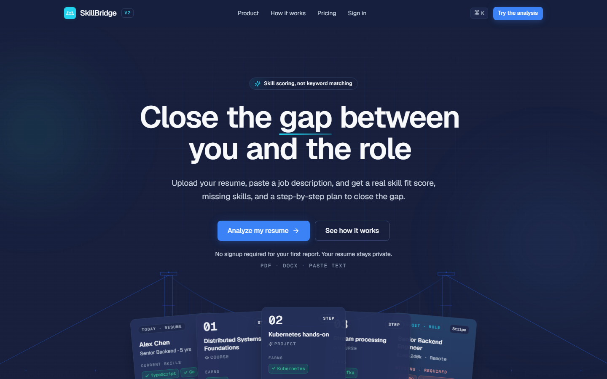
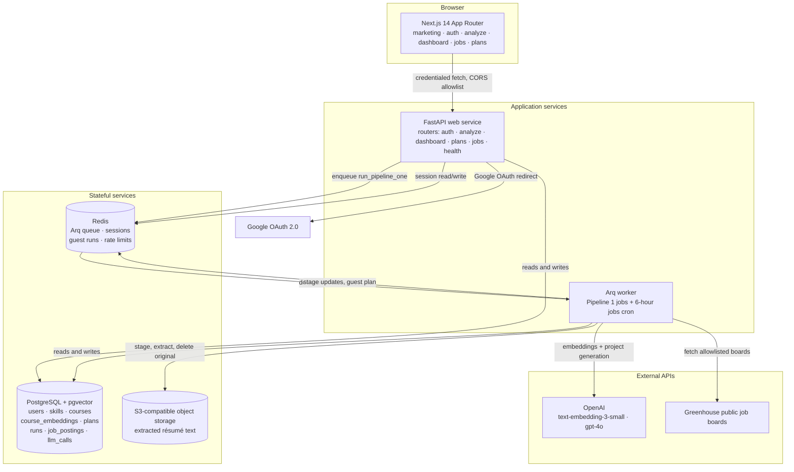
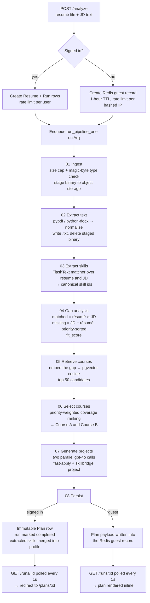
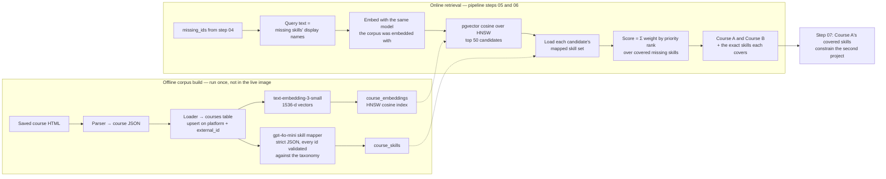
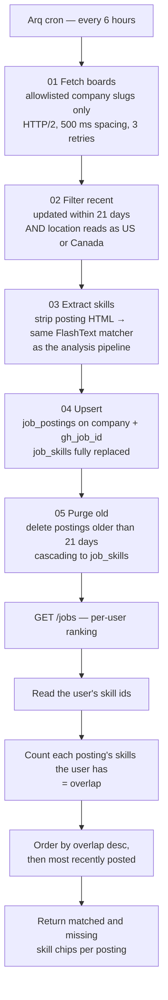
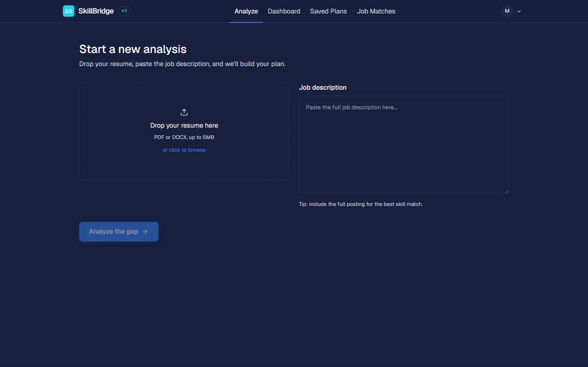
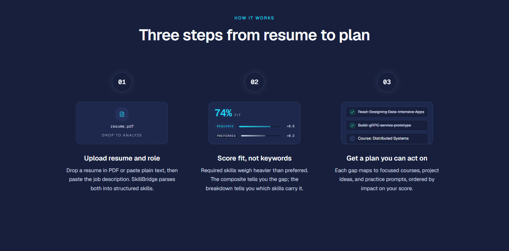

<div align="center">
  
</div>

# SkillBridge 2.0 - LLM Skill Analyzer

A career-planning web application that takes a résumé and a target job description, extracts the
technical skills in both against a single canonical taxonomy, scores the fit, retrieves the courses
that close the gap through vector search, and generates two portfolio projects that demonstrate the
missing skills. A background worker also refreshes public Greenhouse job boards and ranks postings
per user by skill overlap.

Next.js 14 frontend · FastAPI backend · Arq worker on Redis · PostgreSQL with pgvector · OpenAI
embeddings and `gpt-4o` · S3-compatible object storage.


**Live demo: [skillbridge.cv](https://skillbridge.cv/)** — the first analysis runs without an
account.

<p align="center">
  <a href="docs/screenshots/landing.png">
    
  </a>
</p>

## Table of contents

- [Overview](#overview)
- [Key features](#key-features)
- [Engineering highlights](#engineering-highlights)
- [System architecture](#system-architecture)
- [Skill analysis lifecycle](#skill-analysis-lifecycle)
- [RAG recommendation pipeline](#rag-recommendation-pipeline)
- [Job matching pipeline](#job-matching-pipeline)
- [Technology stack](#technology-stack)
- [AI and data implementation](#ai-and-data-implementation)
- [Security and privacy](#security-and-privacy)
- [Screenshots](#screenshots)
- [Testing strategy](#testing-strategy)
- [API reference](#api-reference)
- [Local setup](#local-setup)
- [Local infrastructure with Docker](#local-infrastructure-with-docker)
- [Environment variables](#environment-variables)
- [Deployment](#deployment)
- [Project structure](#project-structure)
- [Known limitations](#known-limitations)
- [Future improvements](#future-improvements)
- [Authors](#authors)

## Overview

SkillBridge answers one question concretely: *given this résumé and this job posting, what is
actually missing, and what should I build or study next?*

A user uploads a PDF or DOCX résumé and pastes a job description. The API validates the upload,
enqueues the work on a Redis-backed Arq worker, and returns a run id immediately. The worker walks
an eight-step pipeline: stage the file to object storage, extract and clean its text, match both
documents against the canonical skill taxonomy, diff the two skill sets into *matched* and
*missing*, embed the gap and retrieve candidate courses from pgvector, rank those candidates by
priority-weighted gap coverage, generate two portfolio projects with two parallel `gpt-4o` calls,
and persist the result. The frontend polls the run and renders the finished plan.

A second, independent pipeline runs on a six-hour cron in the same worker. It fetches postings from
an allowlist of public Greenhouse job boards, filters them by recency and location, tags each with
canonical skill ids using the *same* matcher the analysis pipeline uses, upserts them, and purges
expired rows. `GET /jobs` then ranks those postings for the signed-in user by how many of each
posting's skills the user already has.

The two pipelines never share state, but they share a vocabulary. Every skill on either side —
résumé, job description, course, job posting — is normalized to a canonical id from one file,
`backend/data/taxonomy/skills.json`. That is what makes the scores comparable rather than
coincidental.

## Key features

- **Skill gap analysis** — matched skills, missing skills ordered by how foundational they are, and
  a fit score expressing the share of the job description's skills the résumé already covers.
- **Course recommendations by retrieval** — the gap is embedded and matched against an embedded
  course corpus with pgvector cosine similarity, then re-ranked by how much of *your* gap each
  course actually teaches.
- **Two generated portfolio projects** — one buildable with the skills you already have ("fast
  apply"), one that requires the recommended course's skills as well, so completing the course is
  provable in a repository.
- **Saved plans** — every signed-in analysis is stored as an immutable snapshot and can be reopened
  or deleted from the saved-plans list.
- **Editable skill profile** — a dashboard of the skills extracted from your most recent résumé,
  which you can add to or trim manually; re-analyzing refreshes the extracted set without touching
  manual entries.
- **Ranked job matches** — recent postings from tracked Greenhouse boards, ordered by skill overlap,
  with per-posting matched and missing skill chips.
- **Guest runs** — a full analysis without signing in. The result lives only in Redis under a
  one-hour TTL and is returned inline; no database rows are created for a guest.
- **Google sign-in** — OAuth only, no passwords stored anywhere in the system.

## Engineering highlights

- **One canonical skill vocabulary.** `backend/data/taxonomy/skills.json` holds 1,078 skills across
  eight categories, each with a slug id, a display name, a category, a priority rank, and aliases.
  `app/nlp/taxonomy.py` loads it once per process, validates every entry against
  `categories.json` at load time (a category that doesn't exist, or a `priority_rank` that
  disagrees with its category, raises rather than silently poisoning the matcher), and memoizes the
  result.

- **Deterministic, symmetric skill extraction.** `app/nlp/matcher.py` builds a FlashText keyword
  trie from every surface form — canonical name, all aliases, and the id itself — mapped to the
  canonical id, so a match *returns* the normalized id and normalization is free. There is no
  fuzzy matching and no LLM in this path: the same text always yields the same ids, and both
  pipelines call the same function, which is what makes a job posting's score comparable to a job
  description's.

- **Precision guards inside the matcher.** A second, case-*sensitive* trie rescues short surfaces
  whose lowercase forms are ordinary English (`R`, `Go`, `C`, `AD`), with `#`, `+`, and `&`
  registered as non-word-boundaries so `C#`, `C++`, and `R&D` do not yield `C` or `R`. A separate
  check rejects the `.js` tail of unmapped framework names so `D3.js` does not register as
  JavaScript.

- **Explicit gap scoring.** `matched = résumé ∩ JD`; `missing = JD − résumé`, sorted by
  `priority_rank` ascending so language gaps surface before technique gaps, with the skill id as a
  deterministic tie-break; `fit_score = round(100 × |matched| / |JD|)`. An empty skill set on
  either side is treated as a user-facing failure rather than a zero score, since it means a junk
  upload or a posting with no tech stack.

- **Priority-weighted course ranking.** `app/rag/ranker.py` scores each retrieved course as
  `Σ weight[priority_rank]` over the missing skills it teaches, with `weight = {1: 4, 2: 3, 3: 2,
  4: 1}` — a language gap is worth the most, because it unblocks the most. Ties break on raw
  coverage count, then shorter duration, then `external_id`, so the same gap always produces the
  same two courses. When fewer than two courses cover an exact missing skill, empty slots are
  filled by taxonomy-category overlap rather than left blank.

- **Asynchronous analysis with observable progress.** `POST /analyze` enqueues an Arq job and
  returns `202` with a run id. The orchestrator in `app/pipeline_one/__init__.py` imports each of
  the eight step modules by name, writes `runs.current_stage` before each step, and wraps each step
  in a Logfire span tagged with run id and stage. The frontend polls `GET /runs/{run_id}` once a
  second; the API maps the backend's eight steps onto the six stages the UI displays.

- **Partial-failure tolerance in generation.** The two project generations are fired together with
  `asyncio.gather(..., return_exceptions=True)`. Each call retries three times with exponential
  backoff on transient OpenAI errors only — a malformed request is not retried. If one call fails
  the run still completes with a placeholder in that slot; the run fails only if both fail.

- **Cost accounting per run.** Every chat completion computes its own USD cost from token usage,
  logs it structurally, and appends an `llm_calls` row attributed to the run. The ledger then sums
  the run owner's spend for the day and emits a warning past a configured daily budget.

- **Guest runs without database rows.** A guest analysis lives entirely in one Redis key with a
  one-hour TTL. The pipeline writes stage transitions into that record instead of a `runs` row, and
  the final step writes the whole plan payload into it, which `GET /runs/{run_id}` returns inline.
  When the TTL lapses the run is gone.

- **Server-side sessions, no tokens in the browser.** Google OAuth returns verified claims that are
  upserted into a user row; the session is 32 random bytes stored in Redis, carried by an HttpOnly
  cookie, with a sliding TTL refreshed on every successful read. There are no JWTs and nothing in
  `localStorage` — logout deletes the Redis key.

- **Greenhouse ingestion with an allowlist.** `app/greenhouse/client.py` refuses any company slug
  not present in `data/companies.json` before a request is even constructed, so no user-supplied
  value can reach the HTTP client. Boards are fetched over HTTP/2 with 500 ms spacing and three
  retries on transient failures; a board that keeps failing is logged and skipped for that cycle
  while existing data stays.

- **Bounded, self-cleaning job data.** Postings are kept only if updated within 21 days and located
  in the US or Canada by a documented location heuristic. Each row is upserted on
  `(company, gh_job_id)` and its skill rows fully replaced, so a re-run refreshes rather than
  duplicates. A final step deletes postings older than the same 21-day window, and `GET /jobs`
  applies that window again on read.

- **Object storage that discards the original.** The uploaded binary is written to a temporary
  staging key, read back for parsing, and **deleted** once text extraction succeeds. Only the
  extracted `.txt` is retained, under a content-addressed key, and it is read back through
  short-lived signed URLs from a client hard-bound to a single bucket.

- **Migrations that own their extensions.** Alembic revisions are hand-edited where autogenerate
  cannot help: the first revision runs `CREATE EXTENSION IF NOT EXISTS vector` before any vector
  column exists and creates the HNSW cosine index on `course_embeddings`. In deployment the web
  service runs `alembic upgrade head` as a pre-deploy hook so migrations run exactly once per
  release and the worker never repeats them.

- **Observability that is a no-op without secrets.** Logfire is configured with
  `send_to_logfire="if-token-present"` and Sentry with a `None` DSN when unset, so local runs and
  the test suite behave identically to production wiring minus the export.

## System architecture

Two deployable processes share one image and one database: a FastAPI web service and an Arq worker.
The worker owns both pipelines; the API only enqueues and reads.



## Skill analysis lifecycle

The eight steps live in `backend/app/pipeline_one/`, one directory per step, each with its own
`logic.py`, `schemas.py`, and a README describing its inputs, outputs, and failure modes. The
orchestrator threads a single `PipelineState` through them and updates the run's stage between each.



Failures are typed. A step that hits a user-fixable problem — file over 5 MB, not really a PDF or
DOCX, a scanned PDF with no text layer, no technical skills found on either side — raises a
`PipelineStepError` carrying a message written for the user, and the run is marked `failed` with
that message. Anything unexpected marks the run failed and re-raises so it surfaces in error
tracking; the worker runs with `max_tries=1`, so a failed run is never silently retried.

## RAG recommendation pipeline

Retrieval and ranking are deliberately separate concerns. Retrieval decides *what is plausibly
relevant*; ranking decides *what actually closes this gap*.



Two details make this work rather than merely run. First, the corpus and the query are embedded
through the same module with the same model and dimensionality, so cosine distance is meaningful —
changing either means re-embedding everything. Second, the ranker scores against *mapped skill
ids*, not embedding distance, so a course only wins on gap coverage it can be shown to teach.

## Job matching pipeline

Pipeline 2 lives in `backend/app/pipeline_two/`, runs on the worker's cron at 00:00, 06:00, 12:00,
and 18:00, and can be triggered once on demand with `scripts/trigger_jobs.py` so a fresh deployment
does not start with an empty feed.



Postings are not owned by anyone — the *ranking* is what is per-user, computed at read time from
the user's `user_skills` rows. Two users with different profiles get different orderings over the
same data.

## Technology stack

Frontend:

| Concern | Technology | Purpose |
|---|---|---|
| Framework | Next.js 14 (App Router) | Route groups for marketing, auth, and the signed-in app |
| UI | React 18, TypeScript 5 | Typed, component-driven screens |
| Styling | Tailwind CSS 3, Geist | Utility-first styling and typography |
| Motion / icons | `motion`, `lucide-react` | Transitions that respect reduced-motion, icon set |
| API access | `fetch` with `credentials: "include"` | Credentialed cross-origin calls carrying the session cookie |

Backend:

| Concern | Technology | Purpose |
|---|---|---|
| Language | Python 3.12 | Pinned by `.python-version` and `requires-python` |
| Web framework | FastAPI | Async API, dependency injection, generated OpenAPI docs |
| Server | Uvicorn (Gunicorn available) | ASGI server for the web service |
| ORM / migrations | SQLAlchemy 2.0 async, Alembic | Async data access and versioned schema changes |
| Validation / config | Pydantic v2, pydantic-settings | Request and response schemas, typed environment config |
| Task queue | Arq | Redis-backed job queue and cron for both pipelines |
| Auth | Authlib, itsdangerous | Google OAuth flow and the signed OAuth-state cookie |
| HTTP client | httpx with HTTP/2 | Greenhouse board fetching over a reused connection |
| Retries | tenacity | Backoff on transient OpenAI and Greenhouse failures |
| Package manager | uv | Locked, reproducible installs from `uv.lock` |

AI and data:

| Concern | Technology | Purpose |
|---|---|---|
| Embeddings | OpenAI `text-embedding-3-small`, 1536-d | Course corpus and gap queries in one vector space |
| Generation | OpenAI `gpt-4o` | Two portfolio projects per analysis |
| Corpus mapping | OpenAI `gpt-4o-mini` | Offline course-to-skill mapping, validated against the taxonomy |
| Vector search | PostgreSQL + pgvector, HNSW cosine index | Nearest-course retrieval inside the primary database |
| Skill matching | FlashText | Rule-based canonical extraction from résumé, JD, and postings |
| Document parsing | pypdf, python-docx | Text extraction from PDF and DOCX uploads |
| File-type detection | python-magic | Magic-byte validation of uploads |
| Prompts | Jinja2 templates | Versioned prompt files checked in beside their step |

Infrastructure, testing, and tooling:

| Concern | Technology | Purpose |
|---|---|---|
| Cache / queue / sessions | Redis 7 | Arq queue, sessions, guest runs, rate-limit counters |
| Object storage | boto3 against S3-compatible storage | Extracted résumé text; MinIO locally, Cloudflare R2 in the deploy runbook |
| Local infrastructure | Docker Compose | Postgres with pgvector, Redis, MinIO, one-shot bucket creation |
| Container image | `python:3.12-slim` + uv | One image, two start commands (web and worker) |
| Tests | pytest, pytest-asyncio, fakeredis, moto, freezegun | Unit and integration tests without live third-party services |
| Lint / format | Ruff | `E`, `F`, `I`, `B`, `UP`, `SIM`, `RET` rule sets, 100-column lines |
| Types | mypy | Strict settings scoped to the `app` package |
| Pre-commit | pre-commit | Ruff, Ruff-format, and mypy on staged backend files |
| Observability | Logfire, Sentry | Request and pipeline spans, error reporting; both optional |

## AI and data implementation

**Where the model is used, and where it isn't.** Skill extraction is *not* an LLM task in this
system. It is a FlashText dictionary match against the taxonomy, chosen because extraction has to be
deterministic and symmetric across two pipelines: the same résumé must always produce the same
skills, and a job posting must be tagged by exactly the same rules as a job description. The LLM is
used in three places only — embedding the course corpus, embedding the gap query at analysis time,
and generating the two portfolio projects.

**Constrained generation.** The two project prompts are Jinja2 templates checked into
`app/pipeline_one/07_generate_projects/prompts/`. Both are given an explicit list of skill *display
names* and forbidden from introducing any skill outside that list — that constraint is what stops
the model recommending, say, a Kubernetes deployment to a candidate with no DevOps skills. The
second prompt additionally receives the skills Course A covers, so the project it designs is only
completable once that course has been internalized. Output is bounded by an explicit
`max_tokens` ceiling.

**Validated structured output at corpus build time.** `scripts/map_course_skills.py` asks
`gpt-4o-mini` at temperature 0 for strict JSON of the form `{"skill_ids": [...]}`, tuned for
precision over recall, and then validates every returned id against the taxonomy — unknown ids are
dropped rather than trusted. `course_skills` therefore contains only the same canonical slugs the
matcher produces, which is what makes retrieval scoring symmetric with gap scoring.

**Taxonomy drift detection.** Because extraction is dictionary-based, a technology the taxonomy does
not know is a technology the system cannot see. `python -m app.nlp.audit <dir>` scans a directory of
résumé and JD text for tokens that look like technologies (CamelCase, dotted names, all-caps
acronyms, tech-shaped suffixes) but that the matcher did not recognize, and reports the ones
recurring across several files as candidate taxonomy gaps. It is strictly read-only; accepted
candidates are added by hand.

**Corpus snapshot.** The committed corpus report in
[`backend/docs/phase-2-course-corpus.md`](backend/docs/phase-2-course-corpus.md) records 112 courses
from a single source (DeepLearning.AI), 231 `course_skills` rows across 57 distinct taxonomy ids,
and 112 embeddings. Coverage is weighted toward generative-AI and LLM topics, which is a real
constraint on recommendation quality outside that domain — see
[Known limitations](#known-limitations).

## Security and privacy

Only mechanisms present in the code are listed here.

- **OAuth-only authentication.** Google is the sole sign-in method; no password is ever accepted,
  hashed, or stored, and there is no password-reset surface to misconfigure.
- **Opaque server-side sessions.** A session is 32 random URL-safe bytes stored in Redis as
  `session_id → user_id` with a sliding TTL. The browser holds only that id, in an HttpOnly cookie.
  Logout deletes the Redis key, which invalidates the session immediately.
- **Cookie hardening is environment-driven.** `COOKIE_SECURE` and `COOKIE_SAMESITE` are settings,
  set to `true`/`none` for the cross-origin production pairing and `false`/`lax` for local HTTP
  development. The short-lived OAuth-state cookie is separately signed with `SESSION_SECRET`.
- **CSRF double-submit on state-changing writes.** `PATCH /dashboard` and `DELETE /plans/{id}`
  require an `X-CSRF-Token` header matching a readable `csrf_token` cookie issued at sign-in,
  compared with `secrets.compare_digest`. This is defense in depth on top of SameSite, which stops
  being sufficient once the cookie is `SameSite=None`.
- **Explicit CORS allowlist.** Credentialed CORS cannot use a wildcard, so `FRONTEND_ORIGIN` names
  exactly one permitted origin and the allowed methods are enumerated.
- **Rate limiting on the expensive and abusable paths.** Redis fixed-window counters cap guest
  analyses per IP per day, signed-in analyses per user per day, and requests to the `/auth/*`
  endpoints per IP per minute. Exceeding a limit returns `429` with `Retry-After`.
- **IP addresses are never stored.** The guest and auth limiters key on a SHA-256 of the client IP
  salted with a value derived from `SESSION_SECRET` and the current UTC date, so the identifier is
  non-reversible and rotates daily.
- **Upload validation before any work happens.** Files over 5 MB are rejected outright, and the file
  type is decided by libmagic magic bytes — not the filename or the browser-declared content type —
  with DOCX confirmed by looking for `word/document.xml` inside the archive.
- **The original résumé is not retained.** The uploaded binary is staged, parsed, and then deleted;
  only the extracted plain text is kept, under a content-addressed key, and it is fetched through
  signed URLs valid for five minutes. The storage client is bound to one configured bucket and never
  accepts a user-supplied bucket or URL.
- **SSRF guard on outbound fetching.** The Greenhouse client refuses any company slug not on the
  committed allowlist before building a request, so there is no path from user input to an arbitrary
  outbound URL.
- **PII kept out of telemetry.** Logfire is configured to scrub attributes whose keys match
  email/résumé/JD patterns, Sentry runs with `send_default_pii=False`, request tracing records
  method, path, status, and latency but no bodies, and the app's own structured logs identify users
  by UUID. Helpers exist to mask an email or strip emails from free text where one must be
  referenced.
- **No secrets in the repository.** All configuration is read from the environment through
  `pydantic-settings`. Only `.env.example` and `.env.local.example` are committed; `.env` and
  `.env.*` are git-ignored at the repository root.

## Screenshots

All three images are captured from the running application at a 1440 px viewport width. Paths are
exactly as stored under `docs/screenshots/`. Click any screenshot to open it at full resolution.

### Skill gap analyzer

The signed-in entry point. A résumé is dropped into the left panel (PDF or DOCX, up to 5 MB) and the
full job posting is pasted on the right. The submit button stays disabled until both are present;
submitting enqueues a run and navigates to a live, staged progress view.

<p align="center">
  <a href="docs/screenshots/analyze.png">
    
  </a>
</p>

### How it works

The marketing explainer on the landing page, summarizing the product in three steps: upload the
résumé and the role, get a fit score instead of a keyword count, and receive a plan of courses and
projects ordered by impact.

<p align="center">
  <a href="docs/screenshots/how-it-works.png">
    
  </a>
</p>

### Landing page

The full landing page shown at the top of this README is also available at
[`docs/screenshots/landing.png`](docs/screenshots/landing.png).

## Testing strategy

The backend test suite lives in `backend/tests/` and is split into unit and integration layers.
`pyproject.toml` sets `asyncio_mode = "auto"`, so async tests need no per-test decorator.

| Layer | Location | What it covers |
|---|---|---|
| Unit | `tests/unit/` | Every pipeline step in isolation, the taxonomy loader and integrity rules, the matcher, the RAG ranker, sessions, CSRF, rate limiting, the LLM client, the Greenhouse client, health checks, models, observability |
| Integration | `tests/integration/` | Route-level tests for analyze, auth, dashboard, jobs, and plans; both pipelines end to end; RAG retrieval against real pgvector; the database schema; the cost ledger; object storage; taxonomy sync |
| Fixtures | `tests/fixtures/` | Labeled résumé and job-description corpora, each `.txt` paired with an `.expected.json` skill-id set, plus a separate synthetic smoke corpus |

External dependencies are faked rather than reached: `fakeredis` for Redis, `moto` for S3-compatible
storage, patched clients for OpenAI, and `freezegun` where time matters. The integration tests that
exercise pgvector and schema behaviour need a real Postgres, which `docker compose up -d db`
provides.

**Matcher quality gate.** `tests/unit/nlp/test_matcher_eval.py` runs the matcher over every labeled
fixture pair and asserts micro-averaged F1 above 0.90. Only the human-labeled top-level corpora
count toward the gate; the synthetic set is excluded, and the test skips cleanly if no labeled
fixtures are present.

**Frontend checks.** The frontend has no automated test suite. It is validated by ESLint
(`next lint`, using `eslint-config-next`) and by TypeScript, which `next build` type-checks as part
of the production build.

Reproduce the checks:

```sh
cd backend
uv run ruff check .              # lint
uv run ruff format --check .     # formatting
uv run mypy app/                 # strict type-check of the app package
uv run pytest                    # unit + integration tests (Postgres needed for integration)

cd ../frontend
npm run lint                     # ESLint
npm run build                    # production build, including type-checking
```

**Continuous integration.** The workflow at
[`backend/.github/workflows/ci.yml`](backend/.github/workflows/ci.yml) runs exactly those backend
steps — install with uv, Ruff lint, Ruff format check, mypy, pytest — on pushes to `main` and on
pull requests. As the file's own header notes, GitHub Actions only executes workflows found in the
*repository root* `.github/workflows/`, so this file does not run automatically from its current
location. Moving it is tracked in [Future improvements](#future-improvements); no CI badge is shown
here because none would be truthful yet.

Test counts and coverage percentages are deliberately not published in this README, because they
have not been produced from a verified run against this checkout.

## API reference

FastAPI serves interactive documentation at `/docs` (Swagger UI) and `/redoc` while the server is
running.

| Method | Path | Auth | Description |
|---|---|---|---|
| `GET` | `/healthz` | none | Liveness — 200 only if Postgres and Redis are reachable, else 503 |
| `GET` | `/readyz` | none | Readiness — liveness plus taxonomy loaded and OpenAI authenticating |
| `GET` | `/auth/google/login` | none | Redirect into the Google OAuth consent flow |
| `GET` | `/auth/google/callback` | none | OAuth callback; upserts the user, creates the session, sets `sid` and `csrf_token` |
| `POST` | `/auth/google/logout` | session | Revokes the Redis session and clears both cookies |
| `GET` | `/me` | session | The current authenticated user |
| `POST` | `/analyze` | optional | Multipart `resume` file + `jd_text`; enqueues a run, returns `202` with `run_id` |
| `GET` | `/runs/{run_id}` | optional | Run status, UI stage, and either `plan_id` (signed in) or the inline `plan` (guest) |
| `GET` | `/dashboard` | session | The user's skills grouped by category, with the source résumé filename and date |
| `PATCH` | `/dashboard` | session + CSRF | Add or remove manual skills; unknown skill ids are rejected with 422 |
| `GET` | `/plans` | session | Saved plan summaries, newest first, paginated by `limit` and `offset` |
| `GET` | `/plans/{plan_id}` | session | One full plan: skills, courses with covered skills, and both project documents |
| `DELETE` | `/plans/{plan_id}` | session + CSRF | Delete a saved plan |
| `GET` | `/jobs` | session | Recent postings ranked by skill overlap, paginated by `limit` and `offset` |

## Local setup

Prerequisites:

| Requirement | Version | Notes |
|---|---|---|
| Python | 3.12 | Pinned in `backend/.python-version` and `requires-python` |
| uv | current | Installs from `backend/uv.lock`; also used to run every backend command |
| Node.js | 18.17+ | Required by Next.js 14 |
| npm | bundled with Node | `frontend/package-lock.json` is committed |
| Docker | with Compose v2 | Runs Postgres, Redis, and MinIO locally |

An `OPENAI_API_KEY` is required for a full analysis: two of the five seeding steps and the live
retrieval and generation steps call OpenAI and spend credits.

### 1. Backend

```sh
cd backend
uv sync                                  # install dependencies into .venv from uv.lock
cp .env.example .env                     # local defaults are pre-filled; add your OPENAI_API_KEY
                                         # and Google OAuth credentials
docker compose up -d                     # Postgres (pgvector), Redis, MinIO + bucket creation
uv run alembic upgrade head              # apply migrations, create the vector extension and index
```

### 2. Seed the taxonomy and course corpus

The database is empty after migrations, and an analysis cannot retrieve courses from an empty
corpus. Seeding is a separate, idempotent step:

```sh
./scripts/seed_all.sh                    # 5 steps; the last two call OpenAI and cost money
```

The script runs, in order: taxonomy sync into `skills`/`skill_aliases`, the offline course-HTML
parser, the course loader, the `gpt-4o-mini` course-to-skill mapper, and the embedder. Rebuilding
the corpus from scratch requires a saved copy of the course listing page in `scrapers/input/` — see
[`backend/scrapers/README.md`](backend/scrapers/README.md).

### 3. Run the API and the worker

```sh
uv run uvicorn app.main:app --reload     # API on http://localhost:8000
```

In a second terminal:

```sh
cd backend
uv run arq app.workers.settings.WorkerSettings   # analysis jobs + the 6-hour jobs cron
```

Health checks:

```sh
curl http://localhost:8000/healthz       # {"status":"ok","postgres":true,"redis":true}
curl http://localhost:8000/readyz        # adds taxonomy + OpenAI reachability
```

Optionally populate the jobs feed immediately instead of waiting for the cron:

```sh
uv run python scripts/trigger_jobs.py    # enqueues one refresh; the worker must be running
```

### 4. Frontend

```sh
cd frontend
npm install
cp .env.local.example .env.local         # NEXT_PUBLIC_API_URL defaults to http://localhost:8000
npm run dev                              # http://localhost:3000
```

### One-command alternative

`backend/scripts/dev.sh` performs steps 1, 3, and 4 in a single command — it starts the Docker
services and waits for them to be healthy, applies migrations, launches the API, worker, and
frontend as tracked background processes with logs under `backend/.dev-logs/`, waits for
`/healthz`, and stops everything it started on `Ctrl-C`. It deliberately does *not* seed, because
two seeding steps spend OpenAI credits; it prints a reminder if the `skills` table is empty.

```sh
cd backend
./scripts/dev.sh                         # infra + migrate + serve everything
./scripts/dev.sh --no-serve              # infra + migrate only
```

## Local infrastructure with Docker

`backend/docker-compose.yml` is local-development only and defines four services:

| Service | Image | Port | Purpose |
|---|---|---|---|
| `db` | `pgvector/pgvector:pg16` | 5432 | Postgres with the `vector` extension available; health-checked with `pg_isready`; data persisted in the `pgdata` volume |
| `redis` | `redis:7-alpine` | 6379 | Arq queue, sessions, guest runs, rate-limit counters; health-checked with `redis-cli ping` |
| `minio` | `minio/minio:latest` | 9000 (S3), 9001 (console) | Free, offline, S3-compatible stand-in for Cloudflare R2; data in the `miniodata` volume |
| `minio-setup` | `minio/mc:latest` | — | One-shot container that waits for MinIO, creates the `skillbridge-resumes` bucket, and exits; idempotent |

```sh
docker compose up -d                     # start everything
docker compose ps                        # confirm db and redis are healthy
docker compose logs -f db                # tail Postgres logs
docker compose down                      # stop, keeping volumes
docker compose down -v                   # stop and wipe volumes (re-seeding required afterwards)
```

The MinIO console is at `http://localhost:9001` with the development credentials from
`.env.example`. Pointing `R2_ENDPOINT_URL` at MinIO is what switches the storage client from
Cloudflare R2 to local path-style addressing; leaving it empty derives a Cloudflare endpoint from
`R2_ACCOUNT_ID`.

## Environment variables

Backend variables are read by `app/config.py`; the committed
[`backend/.env.example`](backend/.env.example) documents each one inline and ships working local
defaults for everything except the credentials you must supply yourself. Never commit real values —
`.env` files are git-ignored.

| Variable | Service | Required | Description |
|---|---|---|---|
| `APP_ENV` | backend | no | `development` or `production`; tags Logfire and Sentry events. Defaults to `development` |
| `DATABASE_URL` | backend | yes | Postgres URL using the async driver — must be `postgresql+asyncpg://` |
| `REDIS_URL` | backend | yes | Redis URL for the Arq queue, sessions, guest runs, and rate limits |
| `OPENAI_API_KEY` | backend | yes | Embeddings, project generation, and the offline course mapper |
| `R2_ACCOUNT_ID` | backend | yes | Cloudflare account id; used to derive the storage endpoint when no override is set |
| `R2_ACCESS_KEY_ID` | backend | yes | Object-storage access key |
| `R2_SECRET_ACCESS_KEY` | backend | yes | Object-storage secret key |
| `R2_BUCKET` | backend | yes | Bucket holding extracted résumé text |
| `R2_ENDPOINT_URL` | backend | no | Set to `http://localhost:9000` to use MinIO locally; leave empty for Cloudflare R2 |
| `GOOGLE_CLIENT_ID` | backend | yes | Google OAuth client id |
| `GOOGLE_CLIENT_SECRET` | backend | yes | Google OAuth client secret |
| `OAUTH_REDIRECT_URI` | backend | no | Callback URL; must be allowlisted in the Google console. Defaults to the local callback |
| `SESSION_SECRET` | backend | yes | Signs the OAuth-state cookie and seeds the daily IP-hash salt; use 32+ random bytes |
| `SESSION_COOKIE_NAME` | backend | no | Session cookie name. Defaults to `sid` |
| `SESSION_TTL_SECONDS` | backend | no | Sliding session lifetime. Defaults to `604800` (7 days) |
| `COOKIE_SECURE` | backend | no | HTTPS-only cookies. Defaults to `false`; must be `true` in production |
| `COOKIE_SAMESITE` | backend | no | `lax`, `strict`, or `none`. Defaults to `lax`; cross-origin production needs `none` with `COOKIE_SECURE=true` |
| `FRONTEND_ORIGIN` | backend | no | The single origin allowed to make credentialed requests. Defaults to `http://localhost:3000` |
| `SENTRY_DSN` | backend | no | Empty disables Sentry entirely |
| `LOGFIRE_TOKEN` | backend | no | Empty keeps Logfire local — nothing is exported |
| `NEXT_PUBLIC_API_URL` | frontend | no | Base URL of the backend API. Falls back to `http://localhost:8000` |

## Deployment

The live application is served at **[skillbridge.cv](https://skillbridge.cv/)**.

The repository's deployment configuration targets Railway for the backend, with the frontend
deployed separately as a Next.js application on a different origin. The authoritative runbook —
environment contract, provisioning order, first-boot seeding, OAuth and CORS wiring, verification,
and rollback — is [`backend/docs/deploy.md`](backend/docs/deploy.md).

| Component | Where it runs | Configuration in this repository |
|---|---|---|
| Frontend | Next.js host on its own origin; Vercel in the runbook | `frontend/` — no deployment config file is committed; only `NEXT_PUBLIC_API_URL` must be set |
| API / web service | Railway service built from `backend/Dockerfile` | [`backend/railway.toml`](backend/railway.toml) — starts `uvicorn app.main:app`, health-checks `/healthz`, restarts on failure |
| Background worker | Railway service, same image, different start command | [`backend/railway.worker.toml`](backend/railway.worker.toml) — starts `arq app.workers.settings.WorkerSettings`; no health check |
| Database | Managed Postgres with pgvector | `DATABASE_URL` must use `postgresql+asyncpg://`; the first migration creates the extension and HNSW index |
| Cache / queue | Managed Redis | `REDIS_URL`; shared by the API and the worker |
| Object storage | Cloudflare R2 bucket, S3-compatible | Four `R2_*` variables; leave `R2_ENDPOINT_URL` empty in production |
| Migrations | Web service pre-deploy hook | `preDeployCommand = "alembic upgrade head"` — runs once per release; the worker never repeats it |

Production-specific settings that differ from local development:

- `COOKIE_SECURE=true` and `COOKIE_SAMESITE=none`, because the frontend and API are separate origins
  and browsers only accept `SameSite=None` alongside `Secure`.
- `FRONTEND_ORIGIN` set to the exact frontend origin — credentialed CORS cannot use a wildcard.
- `OAUTH_REDIRECT_URI` set to the deployed API's callback and allowlisted in the Google Cloud
  console, with the frontend origin registered as an authorized JavaScript origin.
- `R2_ENDPOINT_URL` left empty so the Cloudflare endpoint is derived from `R2_ACCOUNT_ID`.
- `APP_ENV=production`, plus `SENTRY_DSN` and `LOGFIRE_TOKEN` if telemetry is wanted.

Seeding is a one-time human step run from a workstation against the production database, not part of
the image: the scrapers and seed scripts are deliberately excluded from `backend/Dockerfile`. Note
that `/readyz` checks that the taxonomy file loads and that the OpenAI key authenticates — it does
not verify that the database has been seeded, so confirm the `skills`, `courses`, and
`course_embeddings` tables are populated before treating a release as live.

> Note: `backend/docs/deploy.md` uses placeholder hostnames from an earlier plan
> (`api.skillbridge.app`, `skillbridge.vercel.app`) rather than the live `skillbridge.cv` domain.
> Treat the hostnames there as examples and the surrounding procedure as current.

## Project structure

```
level-up-llm-skill-analyzer/
├── backend/
│   ├── app/
│   │   ├── api/                    FastAPI routers: analyze, auth, dashboard, jobs, plans, health
│   │   ├── auth/                   Google OAuth flow, Redis-backed sessions
│   │   ├── common/                 CSRF, typed errors, file-type detection, HTML stripping, rate limits
│   │   ├── db/                     Async engine/sessionmaker and the shared Redis client
│   │   ├── greenhouse/             Allowlisted Greenhouse job-board client
│   │   ├── llm/                    OpenAI chat client with retries, embeddings, cost ledger
│   │   ├── models/                 SQLAlchemy models
│   │   ├── nlp/                    Taxonomy loader, FlashText matcher, text cleaning, drift audit CLI
│   │   ├── pipeline_one/           Analysis pipeline, one directory per step (01_ingest … 08_persist)
│   │   ├── pipeline_two/           Jobs pipeline (01_fetch_boards … 05_purge_old)
│   │   ├── rag/                    pgvector retrieval and priority-weighted ranking
│   │   ├── schemas/                Pydantic request/response DTOs
│   │   ├── storage/                S3-compatible object storage client
│   │   ├── workers/                Arq worker settings, tasks, queue helper
│   │   ├── config.py               Environment-driven settings
│   │   ├── deps.py                 Shared FastAPI dependencies
│   │   ├── observability.py        Logfire + Sentry wiring, PII scrubbing
│   │   └── main.py                 Application factory and middleware
│   ├── alembic/                    Migrations, including the pgvector extension and HNSW index
│   ├── data/
│   │   ├── taxonomy/               skills.json + categories.json — the canonical vocabulary
│   │   └── companies.json          Greenhouse board allowlist
│   ├── docs/                       Deploy runbook, course-corpus report
│   ├── scrapers/                   Offline course-corpus tooling; never imported by app/
│   ├── scripts/                    Seeding, taxonomy build, dev bring-up, one-off job trigger
│   ├── tests/                      unit/, integration/, and labeled fixtures/
│   ├── docker-compose.yml          Local Postgres + Redis + MinIO
│   ├── Dockerfile                  One image for both the web and worker services
│   ├── railway.toml                Web service configuration
│   ├── railway.worker.toml         Worker service configuration
│   └── pyproject.toml              Dependencies, Ruff, mypy, and pytest configuration
├── frontend/
│   ├── app/
│   │   ├── (marketing)/            Landing, about, pricing, contact, privacy, terms, resources
│   │   ├── (auth)/                 Sign-in
│   │   └── (app)/                  Analyze, running, plans, saved, dashboard, jobs
│   ├── components/                 app/, landing/, and ui/ component groups
│   ├── lib/api/                    Typed API clients with credentialed fetch and CSRF headers
│   └── package.json
├── docs/screenshots/               README screenshots
├── skills_tax/                     Taxonomy seed data and authoring notes
└── JD-Resumes_examples/            Sample résumés and job descriptions for manual testing
```

## Known limitations

- **The course corpus is single-source and domain-skewed.** All 112 courses come from
  DeepLearning.AI, and coverage is weighted toward generative-AI and LLM topics. Recommendations for
  a non-AI gap fall back to broader category matching and are noticeably weaker.
- **A skill outside the taxonomy is invisible.** Extraction is a dictionary match, so an emerging
  technology absent from `skills.json` is never detected on either side. The audit CLI surfaces
  candidates, but adding them is a manual step.
- **Fit scoring treats every job-description skill equally.** `fit_score` is the plain share of the
  posting's skills the résumé covers; there is no required-versus-preferred weighting in the backend.
  Priority weighting applies only to course ranking and to the display order of missing skills.
- **CI does not run automatically.** The workflow file lives under `backend/.github/workflows/`, and
  GitHub Actions only executes workflows in the repository root.
- **The frontend has no automated tests.** Coverage there is limited to ESLint and the type-check
  performed by `next build`.
- **The dashboard resolves skill names from a static frontend list.** `lib/mock-data/skills.ts`
  contains a small subset of the taxonomy, so a dashboard chip for a skill outside that subset
  displays the raw slug. The plans and jobs endpoints are unaffected — they return display names
  from the backend.
- **Guest results are ephemeral.** A guest run and its plan expire from Redis one hour after the last
  write, and there is no way to recover one afterwards.
- **Job coverage is narrow by construction.** Only 25 allowlisted Greenhouse boards are polled, only
  US and Canada postings are stored, and only the last 21 days are retained.
- **Course duration is unknown corpus-wide.** `duration_hours` is `NULL` for every course, so that
  tie-break in the ranker never fires today; ties are resolved by `external_id`.
- **Analysis latency is dominated by generation.** The two `gpt-4o` calls in step 07 are the slowest
  part of a run, which is why the UI polls a staged progress view rather than blocking on a response.
- **Embeddings are built once.** There is no refresh job; changing the embedding model or adding
  courses requires re-running the offline embedder.

## Future improvements

- Move the CI workflow to the repository root so lint, type-check, and tests run on every push and
  pull request, and publish a status badge once it does.
- Add a frontend test suite (component and end-to-end) alongside the existing lint and type-check.
- Serve the taxonomy from the API so the frontend stops relying on a static skill list for display
  names.
- Broaden the course corpus beyond a single provider and add a refresh job for embeddings.
- Add more job sources beyond Greenhouse, and widen the location filter beyond the US and Canada.
- Distinguish required from preferred skills in the job description and weight the fit score
  accordingly, matching how the landing page frames scoring.
- Persist a job title and company on plans so the saved-plans list shows the role rather than a
  derived heading.
- Give guests an option to claim a completed run by signing in before its TTL expires.

## Authors

- **Ahmed Ali** — [GitHub](https://github.com/AhmedKamal-41)
- **Surjo Barua** — [GitHub](https://github.com/Surfs101)
- **Jiayu Ouyang** — [GitHub](https://github.com/3ouyang3)
- **Ibnan Hasan**

---

<div align="center">

[Live demo](https://skillbridge.cv/) · [Star this repo](https://github.com/AhmedKamal-41/level-up-llm-skill-analyzer)

</div>
